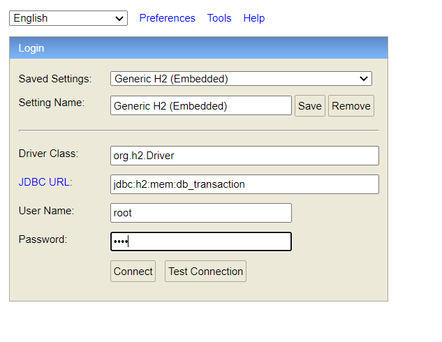

## microservice-2-transaction

### Endpoints

#### Save Transaction
````
POST /api/transaction HTTP/1.1
Host: localhost:4444
Authorization: Basic basic64(username:password)
Content-Type: application/json
Content-Length: 40

{
    "userId":1,
    "productId":1
}
````

#### Get All Transactions Of User
````
GET /api/transaction/1 HTTP/1.1
Host: localhost:4444
Authorization: Basic basic64(username:password)
````

#### Delete Transaction By Id
````
DELETE /api/transaction/1 HTTP/1.1
Host: localhost:4444
Authorization: Basic basic64(username:password)
````

### H2Database Login Informations

Go to "localhost:4444/h2-console" on your browser



User Name : root
Password : 1234
